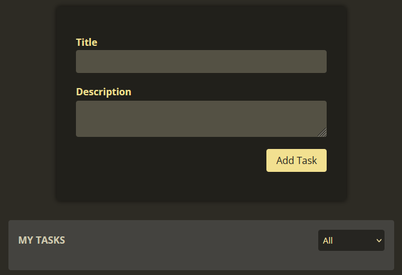
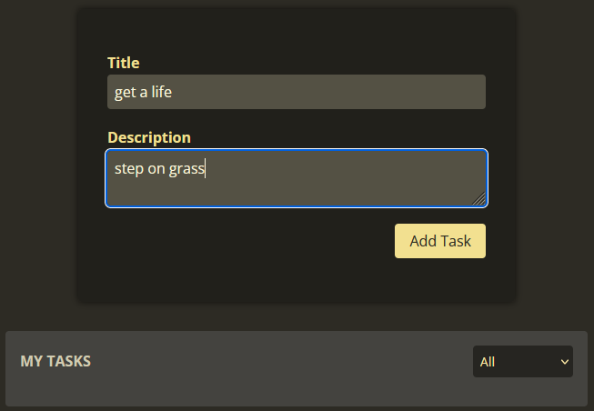
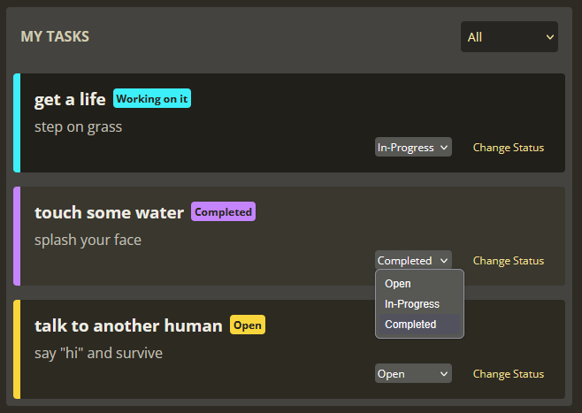
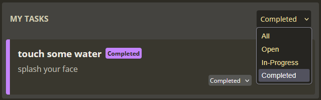

# 📝 Angular Services & Dependency Injection

Projeto desenvolvido com Angular para fins de estudo e prática de conceitos fundamentais de **injeção de dependências** e **organização de lógica de negócio em services**.  

O objetivo principal deste projeto é consolidar boas práticas do framework, separando responsabilidades entre componentes e serviços.

---

## 🚀 Tecnologias Utilizadas

- [Angular 20](https://angular.io/)
- TypeScript
- HTML5 & CSS3
- Vite (via Angular CLI)
- Node.js & npm

---

## ✨ Funcionalidades

- Uso de **services** para centralizar regras de negócio
- Implementação de **dependency injection** em componentes
- Atualização e gerenciamento de dados via serviços
- Arquitetura modular e escalável
- UI simples, focada em aprendizado

---

## 📸 Screenshots

### 🏠 Tela Inicial

---

### ➕ Adicionando uma Nova Tarefa

---

### 🔄 Alterando o Status da Tarefa

---

### 🎯 Filtrando por Status

---

## 🛠️ Como Rodar o Projeto

### Pré-requisitos

- Node.js (v18 ou superior)
- npm (v9 ou superior)

### Instalação

1. Instale as dependências com "npm install"

2. Rode o projeto com "npm start"

A aplicação estará disponível em http://localhost:4200.

---

## 💭 Considerações Finais

Este projeto foi desenvolvido com Angular como parte de um portfólio pessoal, com foco em aprendizado e prática de desenvolvimento front-end moderno.
